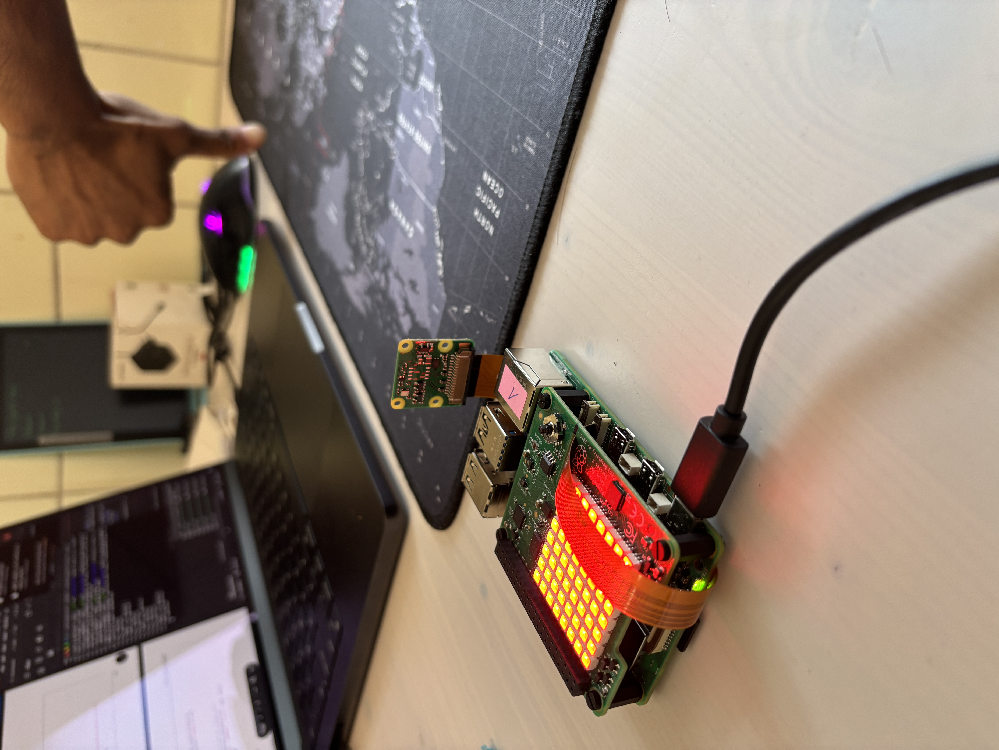

# Gesture-Recognition-using-CNNs-on-Raspberry-Pi
### Building a real-time gesture recognition system using Convolutional Neural Networks (CNNs) deployed on a Raspberry Pi. 

  &nbsp &nbsp &nbsp &nbsp

##  Introduction
This lab focused on building a real-time gesture recognition system using Convolutional
Neural Networks (CNNs) deployed on a Raspberry Pi. The objective was to classify simple
hand gestures, such as “thumbs up” using image data captured from the Pi Camera.
The trained model was then used to control an LED via the Sensor HAT based on the
recognized gesture. This lab demonstrates the integration of computer vision, machine
learning, and embedded system control.
## Methodology
The system uses a binary CNN classifier trained to distinguish between “thumbs up” and
“no thumbs up” gestures. The Raspberry Pi was used to collect training data using its Pi
Camera module, which was then used for training a CNN model using transfer learning
in Google Colab.The VGG16 a 16-layer deep convolutional neural network (CNN) model
was used. The trained model was converted to TensorFlow Lite format and deployed on
the Raspberry Pi. The Raspberry Pi then processed live camera input and used the model
to trigger LED lights based on gesture classification.The LED would light up Green if a
thumps up was detected and Red in other cases.

## Software and Hardware Used
• Programming Language: Python \
• Libraries: TensorFlow, Keras, Picamera2, Numpy, PIL, Sense-HAT \
• Hardware: Raspberry Pi 4, Raspberry Pi Camera, Sensor HAT, Main PC, WiFi-
Router \
• Software: Google Colab

## Implementation
1. Implement the code in capture.py in the RaspberryPi to get the sample refrence images for training the model using the Pi Camera
2. Get the sampel data into your main PC
3. Train the model using VGG16 CNN
4. Compress the trained model
5. Run the code with the predict.py script in the RaspberryPi with "sense hat" to see the result
6. The Sense Hat LED will trun Green if thumps up is detected else red

###### NOTE: Accuracy of the sample data does affect the outcome make sure to get good quality sampple data
###### NOTE: Python3,PiCam2 and other needed libraries should be pre-installed for this to work

## Some Good to know commands:
1.ssh into pi \
  ssh username@hostname.local \
2.copy files \
  scp source destination         <-give the path of the source and destination \
3.to make a venv \
  python3 -m venv venv \
4.to active a venv \
  source venv/bin/activate \
5.to install python packages \
  pip install some-package 
